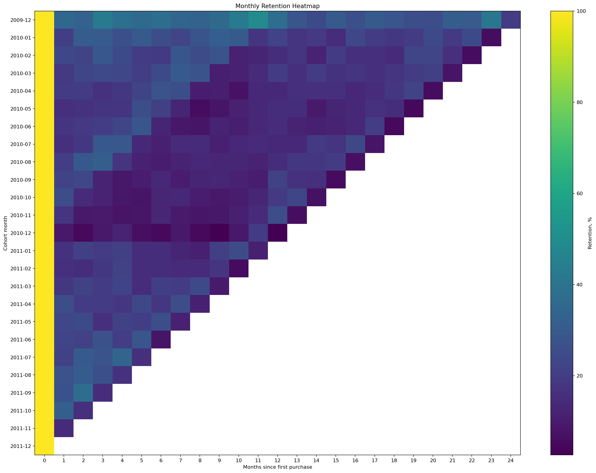
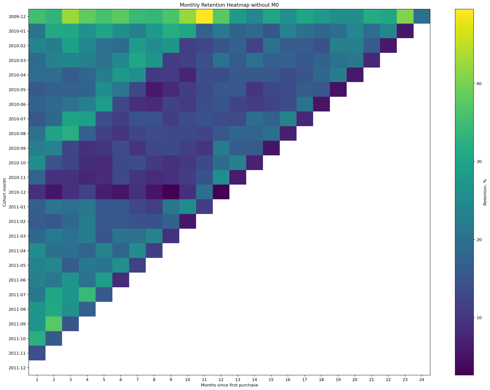
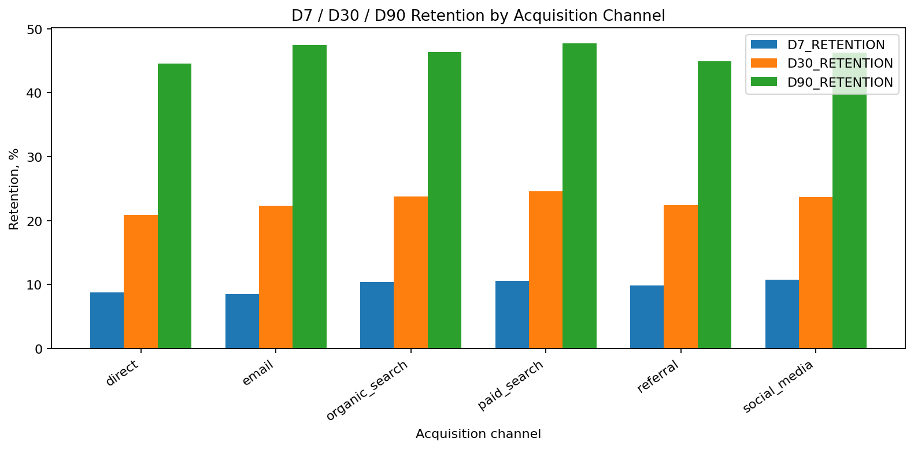
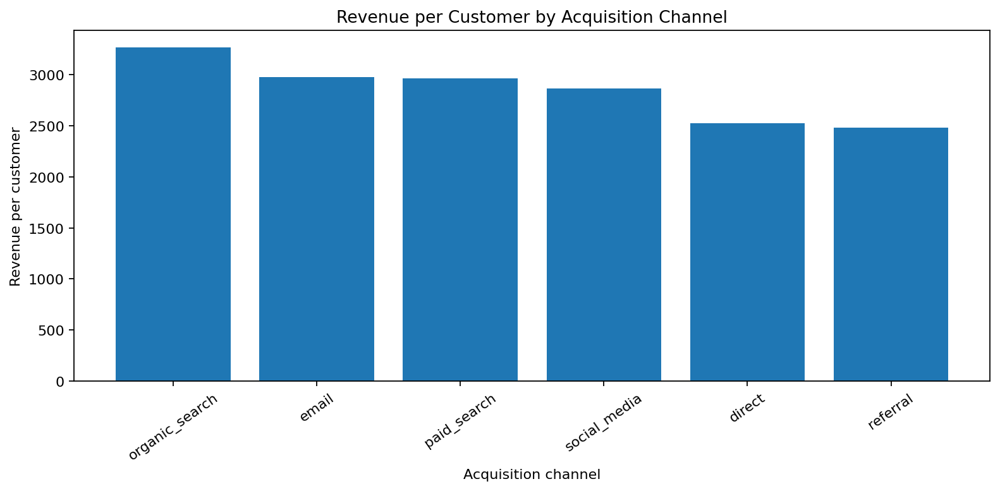

# Customer Retention Cohort Analysis

## Краткое описание

GitHub pet-project по когортному анализу удержания клиентов онлайн-ритейлера. Проект показывает полный аналитический пайплайн: загрузку и очистку транзакционных данных, формирование когорт по месяцу первой покупки, расчет D7/D30/D90 retention, построение retention heatmap, сравнение сегментов по каналу привлечения и формулирование продуктовых гипотез.

## Цель проекта

- Сформировать когорты клиентов по месяцу первой покупки.
- Рассчитать monthly retention, D7, D30 и D90 retention.
- Построить retention heatmap.
- Сравнить retention, revenue per customer и average order value по каналам.
- Сформулировать продуктовые выводы и гипотезы для CRM, маркетинга и ассортимента.

## Бизнес-контекст

Для ритейлера важно понимать, какие клиенты возвращаются после первой покупки, где появляются слабые когорты, какие сегменты выглядят более ценными и где стоит проверять CRM-гипотезы. Когортный анализ помогает смотреть на клиентов с учетом момента первой покупки и не смешивать старую и новую клиентскую базу.

## Датасет

Источник: Kaggle Online Retail II UCI  
https://www.kaggle.com/datasets/mashlyn/online-retail-ii-uci/data

Данные не хранятся в репозитории. Пользователь скачивает датасет вручную с Kaggle и кладет файл в `data/raw/`. Загрузчик поддерживает CSV, XLSX, XLS и ZIP, включая Excel-файлы с несколькими листами.

Основные поля после обработки: `invoice`, `stock_code`, `description`, `quantity`, `invoice_date`, `price`, `customer_id`, `country`, `revenue`, `acquisition_channel`, `cohort_month`, `months_since_first_purchase`.

## Важное примечание про acquisition_channel

В исходном Online Retail II нет канала привлечения. В проекте `acquisition_channel` добавлен синтетически на уровне `customer_id` для демонстрации сегментации. Канал постоянен для всех заказов одного клиента, но не отражает реальный маркетинговый источник. Для полноценной оценки каналов нужны CAC, marketing spend, campaign source и маржинальность.

## Стек технологий

- Python
- pandas
- numpy
- matplotlib
- Jupyter Notebook
- openpyxl
- xlrd

Seaborn не используется.

## Структура проекта

```text
customer-retention-cohort-analysis/
├── README.md
├── requirements.txt
├── .gitignore
├── data/
│   ├── raw/
│   │   └── .gitkeep
│   └── processed/
│       └── .gitkeep
├── notebooks/
│   ├── 01_data_preparation.ipynb
│   ├── 02_cohort_analysis.ipynb
│   ├── 03_retention_by_channel.ipynb
│   └── 04_business_conclusions.ipynb
├── src/
│   ├── __init__.py
│   ├── preprocessing.py
│   ├── cohort.py
│   └── visualization.py
├── reports/
│   ├── 01_cohort_report.md
│   ├── 02_channel_retention_report.md
│   └── final_report.md
└── images/
```

## Как скачать данные с Kaggle

1. Откройте страницу датасета: https://www.kaggle.com/datasets/mashlyn/online-retail-ii-uci/data
2. Скачайте файл вручную через интерфейс Kaggle.
3. Положите CSV/XLSX/XLS/ZIP в `data/raw/`.

`data/raw/*` исключен из git, кроме `data/raw/.gitkeep`.

## Как запустить проект локально

```powershell
python -m venv .venv
.venv\Scripts\activate
pip install -r requirements.txt
python -m ipykernel install --user --name customer-retention-cohort-analysis
```

## Порядок запуска ноутбуков

1. `notebooks/01_data_preparation.ipynb`
2. `notebooks/02_cohort_analysis.ipynb`
3. `notebooks/03_retention_by_channel.ipynb`
4. `notebooks/04_business_conclusions.ipynb`

## Методология анализа

- `cohort_month` - месяц первой покупки клиента.
- `order_month` - месяц заказа.
- `months_since_first_purchase` - номер месяца жизни клиента относительно первой покупки.
- Monthly retention - доля клиентов когорты, активных в соответствующий месяц жизни.
- D7/D30/D90 retention - доля клиентов с хотя бы одной повторной покупкой после первой покупки в течение 7, 30 или 90 дней.
- Первая покупка не считается повторной.
- Retention не доказывает причинность; различия могут быть связаны с сезонностью, промо, ассортиментом или составом аудитории.

## Основные результаты

| Метрика | Значение |
| --- | --- |
| Очищенное количество строк | 779 425 |
| Клиенты | 5 878 |
| Заказы | 36 969 |
| Период данных | 2009-12-01 - 2011-12-09 |
| Страны | 41 |
| Общая выручка | 17 374 804.27 |
| Средний D7 retention | 8.20% |
| Средний D30 retention | 20.97% |
| Средний D90 retention | 42.22% |
| Лучшая когорта по D30 | 2009-12 (33.30%) |
| Худшая когорта по D30 | 2011-12 (3.57%) |
| Лучший канал по D30 | paid_search (24.59%) |
| Лучший канал по revenue_per_customer | organic_search (3 268.16) |

## Основные графики









## Ключевые выводы

- Monthly retention после M0 заметно ниже, поэтому первые повторные покупки являются ключевым этапом клиентского пути.
- D7/D30/D90 здесь считаются как cumulative repeat-purchase windows: D90 включает клиентов, вернувшихся в первые 7 и 30 дней.
- Когорта 2009-12 показывает лучший D30/D90 retention, но требует осторожной интерпретации из-за начала периода наблюдения.
- Когорта 2011-12 имеет самый низкий D30/D90 retention; для нее горизонт наблюдения неполный, так как датасет заканчивается 2011-12-09.
- Лучший канал по D30/D90 retention - `paid_search`, а лучший по revenue_per_customer - `organic_search`; это показывает, что сегменты нужно сравнивать по нескольким метрикам.
- Выводы по каналам являются демонстрационными, потому что `acquisition_channel` синтетический.

## Продуктовые гипотезы

- Welcome campaign после первой покупки может увеличить раннюю повторную покупку.
- D7-триггер может вернуть клиентов, которые не сделали второй заказ в первую неделю.
- D30-персональное предложение может помочь слабым когортам.
- D90-реактивация может вернуть клиентов без устойчивого повторного поведения.
- Декабрьские когорты стоит анализировать отдельно из-за возможных подарочных и сезонных покупок.
- Сегментацию по каналу нужно заменить реальными UTM/source данными.
- Анализ первой товарной категории может показать, какие покупки чаще приводят к retention.

## Отчеты

- [Когортный анализ удержания клиентов](reports/01_cohort_report.md)
- [Анализ удержания по каналам привлечения](reports/02_channel_retention_report.md)
- [Итоговый отчет](reports/final_report.md)

## Ограничения проекта

- Данные исторические и не содержат реальных каналов привлечения.
- `acquisition_channel` синтетический.
- Нет CAC, marketing spend, ROMI и полного LTV.
- Нет данных о коммуникациях, промо и веб-сессиях.
- Retention показывает связь во времени, но не доказывает причинность.
- Последние когорты имеют неполный горизонт наблюдения для D30/D90.

## Что демонстрирует проект

- Подготовку транзакционных данных.
- Когортный анализ и retention-метрики.
- Продуктовую интерпретацию аналитики.
- Сегментацию клиентов.
- Визуализацию на matplotlib.
- Оформление аналитического pet-project для GitHub и резюме.

## Что можно улучшить дальше

- Добавить реальные UTM/source данные.
- Добавить marketing spend и CAC.
- Рассчитать LTV и payback period.
- Объединить RFM и cohort analysis.
- Добавить product/category cohorts.
- Построить BI dashboard.
- Провести A/B-тест CRM-гипотез.
